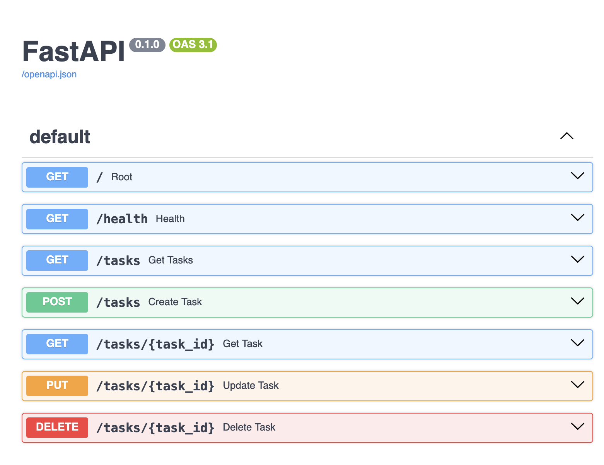
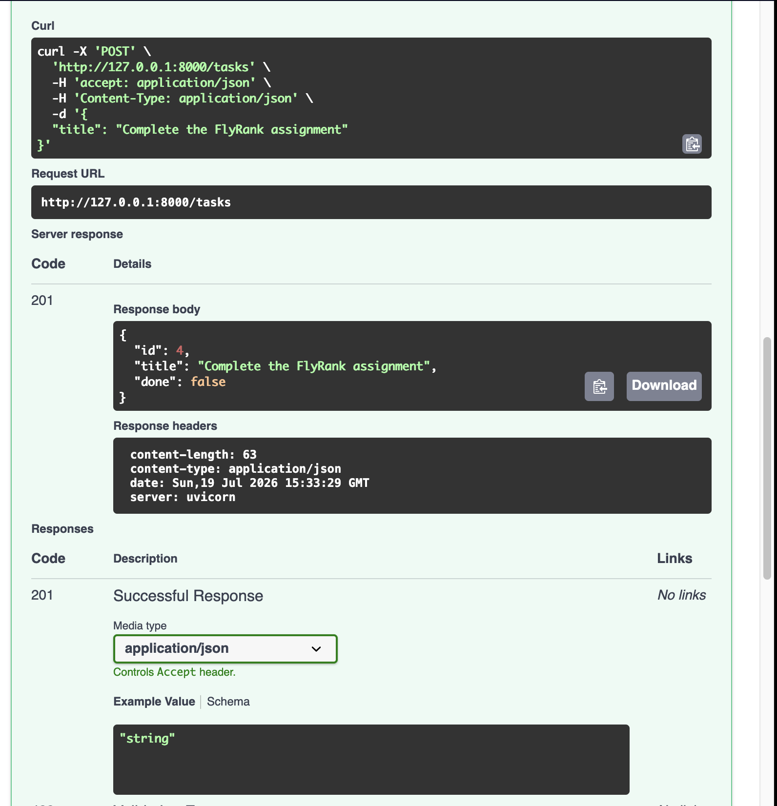
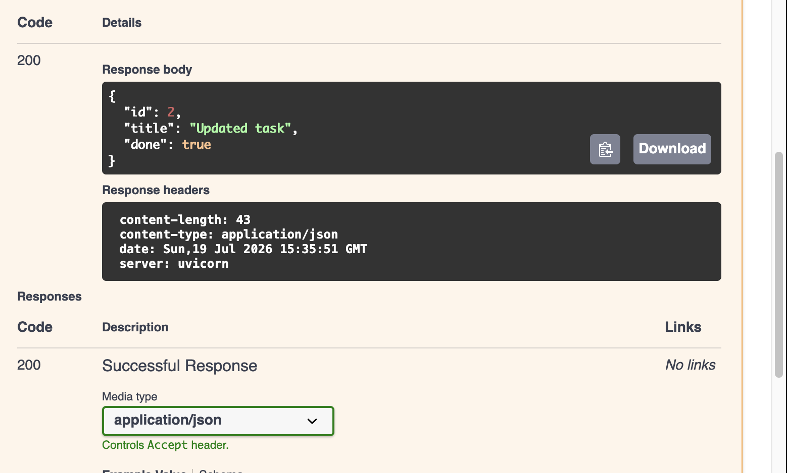
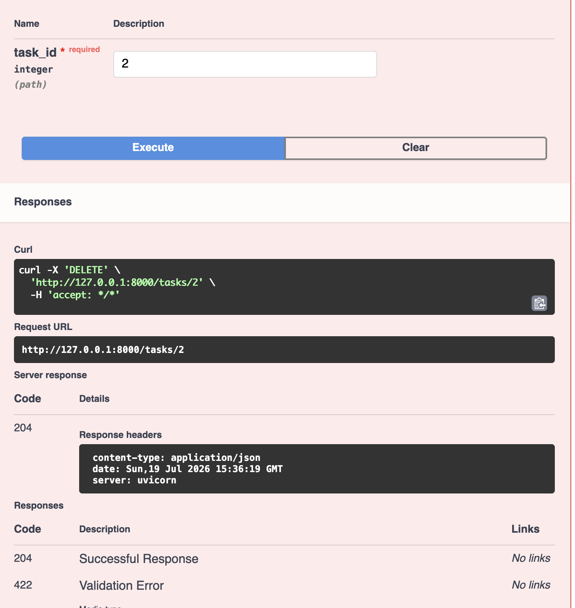
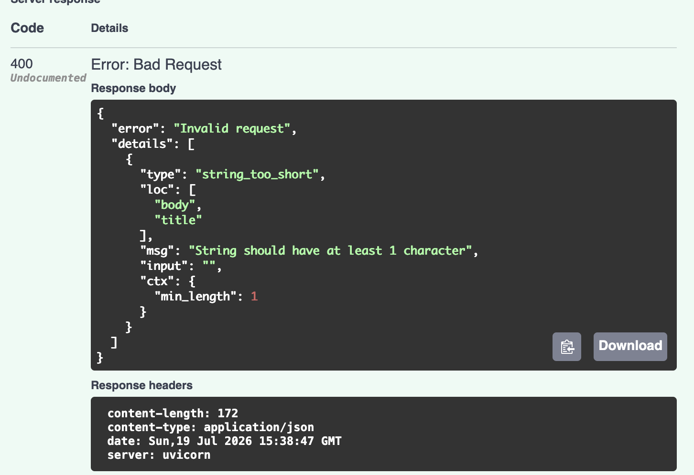

# FlyRank CRUD API

This project was developed as part of the **FlyRank Backend Internship – Week 2 Assignment**.

The objective of this assignment was to build a RESTful CRUD API using FastAPI while developing a practical understanding of core backend concepts and how REST APIs work.

The project explores the complete request–response lifecycle by implementing CRUD operations, request validation, HTTP status codes, error handling and interactive API documentation with Swagger UI.

To keep the focus on understanding REST API design and backend fundamentals, tasks are stored in an in-memory list rather than a database.

## Features

- Create, retrieve, update and delete tasks
- RESTful API design using FastAPI
- Request validation with Pydantic
- Custom validation error handling
- Appropriate HTTP status codes
- Interactive API documentation with Swagger UI


## Technologies

- Python
- FastAPI
- Pydantic
- Uvicorn

## Installation

Clone the repository.

```bash
git clone https://github.com/irembezci/flyrank-crud-api.git
```

Navigate to the project directory.

```bash
cd flyrank-crud-api
```

Create a virtual environment.

```bash
python -m venv venv
```

Activate the virtual environment.

### macOS / Linux

```bash
source venv/bin/activate
```

### Windows

```bash
venv\Scripts\activate
```

Install the required packages.

```bash
pip install fastapi uvicorn
```


## Running the Application

Start the development server.

```bash
uvicorn main:app --reload
```

Once the server is running, open the following URL to access the interactive API documentation.

```
http://127.0.0.1:8000/docs
```


## API Endpoints

| Method | Endpoint | Description |
|---------|----------|-------------|
| GET | `/` | API information |
| GET | `/health` | Health check |
| GET | `/tasks` | Retrieve all tasks |
| GET | `/tasks/{id}` | Retrieve a task by ID |
| POST | `/tasks` | Create a new task |
| PUT | `/tasks/{id}` | Update an existing task |
| DELETE | `/tasks/{id}` | Delete a task |


## Example Request

```bash
curl -i http://127.0.0.1:8000/tasks/1
```

### Example Response

```http
HTTP/1.1 200 OK
content-type: application/json

{
    "id": 1,
    "title": "Learn FastAPI",
    "done": false
}
```


## Swagger UI

FastAPI automatically generates interactive API documentation, making it easy to test each endpoint directly from the browser.

### API Documentation



### Create a Task



### Update a Task



### Delete a Task



### Request Validation

Submitting an invalid request, such as an empty task title, returns a validation error.




## Project Structure

```text
flyrank-crud-api/
│
├── main.py
├── README.md
├── .gitignore
└── images/
    ├── swagger-home.png
    ├── post-task.png
    ├── put-task.png
    ├── delete-task.png
    └── validation.png
```


## Development Process

The project was developed incrementally by following the assignment stages.

- Stage 1 – Basic FastAPI setup
- Stage 2 – Read endpoints
- Stage 3 – Create endpoint with validation
- Stage 4 – Update and delete endpoints
- Stage 5 – Request validation and Swagger UI
- Stage 6 – Publish the project and documentation
